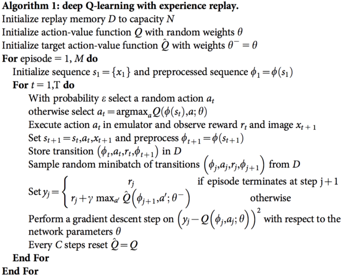

# Pseudo Code Quick Reference
List of pseudo code of some state-of-the-art reinforcement learning algorithms collections for quick reference.

# Q - Q-Learning

# DQN - Deep Q Network

# SARSA - State–Action–Reward–State–Action

# VPG - Vanilla Policy Gradient

# PPO - Proximal Policy Optimization

# DDPG - Deep Deterministic Policy Gradient

# TD3 - Twin Delayed DDPG

# SAC - Soft Actor-Critic
